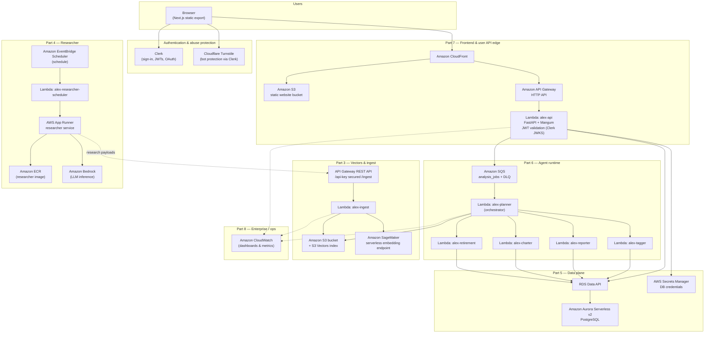

# Alex AI Financial Advisor

**Portfolio project — production-grade, multi-agent financial intelligence platform.**  
Orchestrated LLM agents, serverless AWS, vector RAG on **Amazon S3 Vectors**, and a **Next.js** client with **Clerk** auth — built to show how real AI products are shipped, not just demoed.

[](https://aws.amazon.com/)
[](https://nextjs.org/)
[](https://www.python.org/)
[](https://www.terraform.io/)

| | |
|--|--|
| **Author** | **Jimmy Kimani** — [github.com/jimmykimani](https://github.com/jimmykimani) |
| **Live demo** | *Add your CloudFront URL here after deploy* |
| **Highlights** | Multi-agent **SQS** pipeline · **Aurora Serverless v2** + Data API · **Bedrock** / agent SDKs · **Polygon** market data |


> **For recruiters & engineers:** This README is the system design doc — architecture diagram, stack tables, and deployment map are below. Open in GitHub or in your editor preview for Mermaid rendering.

> In Cursor: right-click this file → **Open Preview** for formatted view.

---

## Why this project stands out

- **Agentic architecture** — A real **orchestrator** (Planner Lambda) delegating to specialists (tagging, reporting, charts, retirement) over **SQS**, not a single monolithic prompt.
- **Modern data plane** — **PostgreSQL on Aurora Serverless v2** via **RDS Data API** (no connection pooling drama in Lambda), secrets in **Secrets Manager**.
- **Cost-aware RAG** — Embeddings on **SageMaker**; vectors in **S3 Vectors** (course design targets major savings vs. always-on search clusters).
- **Split API surface** — User JWT API (**HTTP API Gateway** + **Clerk**) vs. ingest API (**REST** + API key): how production systems separate concerns.
- **IaC discipline** — Terraform split by concern (`terraform/2_*` … `8_*`) so the blast radius of changes stays understandable in interviews.

---

## Attribution

This codebase grows from the **Alex** capstone in the **AI in Production** curriculum (**Edward Donner**). This repository is **my own portfolio copy**: I operate the AWS deployment, env wiring, frontend/auth hardening, and this documentation for hiring managers — not an official course hand-in. Upstream course repo (for comparison / updates): [github.com/ed-donner/alex](https://github.com/ed-donner/alex).

---

## What Alex Does

- **User-facing app**: Sign in (Clerk, including social providers), manage accounts, run portfolio **analysis** jobs, view dashboards, advisor team, and markdown reports with charts.
- **Agent pipeline**: An orchestrator (**Planner**) coordinates specialized Lambdas (**Tagger**, **Reporter**, **Charter**, **Retirement**) using **AWS Lambda**, **SQS**, and **Aurora PostgreSQL** (Data API).
- **Knowledge base**: Documents are embedded via **Amazon SageMaker** (Hugging Face–based embedding model) and stored in **Amazon S3 Vectors** for retrieval during analysis.
- **Background research**: A **Researcher** service (container on **AWS App Runner**) runs on a schedule (**Amazon EventBridge** + **Lambda** scheduler), uses **LLMs** (e.g. **Amazon Bedrock** / OpenAI via agents stack), and feeds the vector index through the ingest path.
- **Market data**: **Polygon.io** for instrument/market data where configured (e.g. Planner stack).
- **Observability**: **Amazon CloudWatch** dashboards (Part 8), optional **Langfuse** tracing in agent code paths.

---

## High-Level Architecture

The diagram below is a single end-to-end view: browser → edge → API → database, async agents, vectors, embeddings, and the scheduled researcher path.



**How to read it**

- **CloudFront** serves the **Next.js** static assets from **S3** and routes **`/api/*`** to the **HTTP API** that invokes **`alex-api`**.
- **`alex-api`** enqueues work on **SQS**; **`alex-planner`** consumes SQS and **invokes** the specialist Lambdas; all agents persist state via **Aurora Data API**.
- **Ingest** (Part 3) is a separate **REST** API (typically **API key**) used to embed and upsert vectors into **S3 Vectors** using **SageMaker** embeddings.
- **Researcher** runs on **App Runner** on a timer chain (**EventBridge Scheduler** → **`alex-researcher-scheduler`** Lambda), uses **Bedrock** (and/or other LLM providers per code/config), and pushes content through the ingest/API path as designed in the guides.

For a deeper **agent-only** diagram and sequence flows, see [`guides/agent_architecture.md`](guides/agent_architecture.md). For the **S3 Vectors**-centric pipeline picture, see [`guides/architecture.md`](guides/architecture.md).

---

## Repository Layout

| Path | Purpose |
|------|---------|
| [`guides/`](guides/) | Step-by-step deployment and course instructions (`1_permissions.md` … `8_enterprise.md`) |
| [`frontend/`](frontend/) | **Next.js 15** (Pages Router) UI: Clerk, Tailwind v4, Recharts, static export for S3/CloudFront |
| [`backend/`](backend/) | **Python 3.12** monorepo ( **uv** workspace ): `api`, `database`, agent Lambdas, `ingest`, `scheduler`, `researcher`, etc. |
| [`terraform/`](terraform/) | Split Terraform stacks per part: `2_sagemaker`, `3_ingestion`, `4_researcher`, `5_database`, `6_agents`, `7_frontend`, `8_enterprise` |
| [`scripts/`](scripts/) | Helper tooling (see course materials) |
| [`assets/`](assets/) | Images and static assets for docs |

---

## Technology Stack

### Cloud & infrastructure (AWS)

| Category | Services & patterns |
|----------|---------------------|
| **IaC** | [Terraform](https://www.terraform.io/) ≥ 1.x, HashiCorp **AWS** & **random** providers |
| **Compute** | **AWS Lambda** (Python 3.12) — API, ingest, planner, tagger, reporter, charter, retirement, scheduler |
| **Containers** | **Amazon ECR** + **AWS App Runner** (Researcher) |
| **APIs** | **Amazon API Gateway** — HTTP API (Part 7 user API), REST API + API keys (Part 3 ingest) |
| **Messaging** | **Amazon SQS** (primary queue + **DLQ**) for analysis jobs |
| **Database** | **Amazon Aurora Serverless v2** (PostgreSQL), **RDS Data API**, credentials in **Secrets Manager** |
| **Object storage** | **Amazon S3** — static frontend bucket; separate **S3 Vectors** bucket/index for embeddings |
| **ML inference** | **Amazon SageMaker** serverless **real-time endpoint** (Hugging Face–style embedding container) |
| **LLM (research / agents)** | **Amazon Bedrock** (configurable model/region); OpenAI-compatible paths via **OpenAI Agents** / LiteLLM where used |
| **Scheduling** | **Amazon EventBridge** → Lambda scheduler |
| **CDN** | **Amazon CloudFront** in front of S3 website + API origin for `/api/*` |
| **Observability** | **Amazon CloudWatch** (logs, metrics, Part 8 dashboards) |

### Frontend

| Tech | Role |
|------|------|
| [Next.js](https://nextjs.org/) **15.5** (Pages Router) | Static export, routing, builds |
| [React](https://react.dev/) **19** | UI |
| [TypeScript](https://www.typescriptlang.org/) **5** | Type safety |
| [Tailwind CSS](https://tailwindcss.com/) **4** | Styling (`@tailwindcss/postcss`) |
| [Clerk](https://clerk.com/) `@clerk/nextjs` | Auth, sessions, JWTs for API |
| [Recharts](https://recharts.org/) | Portfolio / allocation charts |
| [react-markdown](https://github.com/remarkjs/react-markdown) + [remark-gfm](https://github.com/remarkjs/remark-gfm) + [remark-breaks](https://github.com/remarkjs/remark-breaks) | Render analysis markdown |
| [@microsoft/fetch-event-source](https://github.com/Azure/fetch-event-source) | SSE-style streaming to the UI where used |
| [ESLint](https://eslint.org/) + `eslint-config-next` | Linting |

### Backend (Python — representative packages)

| Area | Libraries |
|------|-----------|
| **Packaging / runtime** | [uv](https://github.com/astral-sh/uv), Python **3.12**, workspace + editable `alex-database` package |
| **API (Lambda)** | [FastAPI](https://fastapi.tiangolo.com/), [Mangum](https://github.com/jordaneremieff/mangum) (ASGI on Lambda), [fastapi-clerk-auth](https://pypi.org/project/fastapi-clerk-auth/), [python-jose](https://github.com/mpdavis/python-jose), [httpx](https://www.python-httpx.org/) |
| **Agents & LLM tooling** | [openai-agents](https://github.com/openai/openai-agents-python) (with **LiteLLM** extras where configured), [pydantic-ai](https://github.com/pydantic/pydantic-ai), [Pydantic](https://docs.pydantic.dev/) |
| **AWS SDK** | [boto3](https://boto3.amazonaws.com/v1/documentation/api/latest/index.html) |
| **Data access** | Custom `alex-database` package (Aurora **Data API**, Pydantic models) |
| **Ingest / vectors** | [opensearch-py](https://github.com/opensearch-project/opensearch-py) (client patterns), [requests](https://requests.readthedocs.io/), [requests-aws4auth](https://github.com/sam-washington/requests-aws4auth), **S3 Vectors** API via boto3 |
| **Researcher service** | [Playwright](https://playwright.dev/python/) (browser automation), [Uvicorn](https://www.uvicorn.org/) (local/dev), FastAPI |
| **Resilience** | [Tenacity](https://github.com/jd/tenacity) |
| **Config** | [python-dotenv](https://github.com/theskumar/python-dotenv) |
| **Observability (optional)** | [Langfuse](https://langfuse.com/) Python SDK |
| **Market data** | [polygon-api-client](https://github.com/polygon-io/client-python) (Planner / agents) |

### External SaaS & APIs

| Service | Usage |
|---------|--------|
| **Clerk** | User authentication, JWT issuance, JWKS URL for `alex-api` |
| **Cloudflare Turnstile** | Bot protection integrated with Clerk (browser widget) |
| **Polygon.io** | Market / instrument data (`POLYGON_API_KEY`, plan-aware) |
| **OpenAI** (optional path) | Researcher / agents when routed via OpenAI or compatible APIs |
| **Langfuse** (optional) | Tracing and eval hooks in agent code |

---

## Deployment Order (Course Guides)

Follow the numbered guides in [`guides/`](guides/) — each Terraform directory is designed to be applied **after** its prerequisites exist.

| Part | Guide | Terraform / focus |
|------|--------|-------------------|
| 1 | [`guides/1_permissions.md`](guides/1_permissions.md) | AWS account, IAM baseline |
| 2 | [`guides/2_sagemaker.md`](guides/2_sagemaker.md) | `terraform/2_sagemaker` — embedding endpoint |
| 3 | [`guides/3_ingest.md`](guides/3_ingest.md) | `terraform/3_ingestion` — S3 Vectors, ingest Lambda, REST API |
| 4 | [`guides/4_researcher.md`](guides/4_researcher.md) | `terraform/4_researcher` — ECR, App Runner, researcher |
| 5 | [`guides/5_database.md`](guides/5_database.md) | `terraform/5_database` — Aurora, Data API, secrets |
| 6 | [`guides/6_agents.md`](guides/6_agents.md) | `terraform/6_agents` — SQS, planner + specialist Lambdas |
| 7 | [`guides/7_frontend.md`](guides/7_frontend.md) | `terraform/7_frontend` — S3 site, CloudFront, HTTP API, `alex-api` Lambda |
| 8 | [`guides/8_enterprise.md`](guides/8_enterprise.md) | `terraform/8_enterprise` — CloudWatch dashboards |

---

## Prerequisites

- **AWS account** with CLI configured (`aws configure` or equivalent SSO).
- **Terraform** installed.
- **Node.js** (LTS recommended) and **npm** for `frontend/`.
- **Python 3.12** and **uv** for `backend/` and packaging Lambdas per guides.
- **Docker** (optional but typical for Part 4 ECR image builds; alternative packaging paths may be used where documented).
- Third-party accounts as needed: **Clerk**, **Polygon**, **OpenAI** (if used), **Langfuse** (optional).

---

## Environment & secrets

- Copy [`.env.example`](.env.example) → **`.env`** at the repo root and fill values as each guide completes.
- **Never commit** real secrets: `.gitignore` excludes `.env`, `*.tfvars`, Lambda zip artifacts, and `.terraform/` state dirs.
- Frontend local dev: use **`frontend/.env.local`** for `NEXT_PUBLIC_*` Clerk keys and API base URL (see Part 7 guide).

---

## Local development (frontend)

```bash
cd frontend
# Create .env.local with NEXT_PUBLIC_CLERK_* and NEXT_PUBLIC_API_URL (see guides/7_frontend.md)
npm install
npm run dev
```

Production static site: `npm run build` produces `out/` for sync to the S3 bucket (see Part 7).

---

## Security notes

- **JWT validation** for the user API happens in **`alex-api`** using Clerk’s **JWKS** and **issuer** (configured via Terraform variables / Lambda environment).
- **Ingest REST API** uses **API keys** (Part 3) — separate from end-user Clerk tokens.
- **Aurora** is reached via **Data API** with **Secrets Manager**; avoid exposing ARNs or keys in git or screenshots.

---

## AI assistant onboarding (optional)

For structured help inside an AI IDE, the repo includes **`gameplan.md`**, **`CLAUDE.md`**, and **`AGENTS.md`**. Point your agent at those files plus **`guides/*.md`** before changing infrastructure.

---

## Git remotes (this portfolio copy)

- **`origin`** — this portfolio repository under **jimmykimani** (push here for recruiters).
- **`upstream`** — optional link to [ed-donner/alex](https://github.com/ed-donner/alex) if you want to merge course updates: `git fetch upstream && git merge upstream/main`.

---

## License

Licensed under the **MIT License** — see [LICENSE](LICENSE). Original Alex capstone © Ed Donner; portfolio deployment and documented changes © Jimmy Kimani (see license header).
